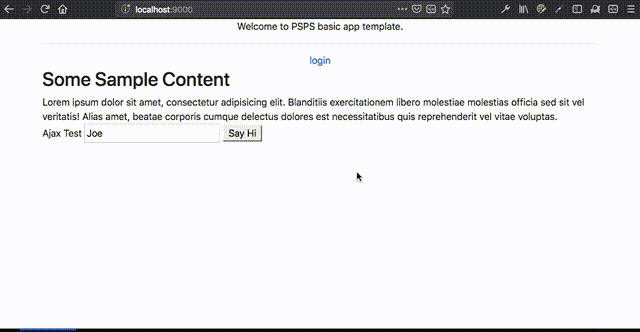

# PSPS
Play-Scala-Postgres-Slick stack, by The Improvery.

## Overview



### What is this?
A seed project for websites that have user accounts, a public side, and database connectivity.

### Why
[Play framework](http://playframework.com) is a very powerful, and a very non-opinionated, web platform. It's a please to use, but we found ourselves implementing standard functionality over and over again. Thus, we decided to just write it once, properly (we hope) and then fork when needed.

#### Why not Sub-Class Play?
Sure, that's the textbook way of doing it. But it's impractical, especially as Play goes through an evolution of its own (and a non-backward-compatible one, too). Additionally, Play is large enough to have a non-trivial learning curve. Which is added to Scala's non-trivial learning curve. That's enough curves.

### Who
The Improvery™ (as in: "us") is a software studio that creates custom software systems. When we develop web systems, and are free to choose a technology stack, we tend to use Play+Scala. PSPS is a consolidation of the knowledge and practices we've accumulated over the last few years, doing [numerous](http://ecf.org.il) [web](http://index.genevainitiative.org) [sites](http://decision-trees.force11.org) (plus some we can't list here yet).

### How
PSPS uses the following technologies:
* The [Scala](http://scala-lang.org) variant of [Play Framework](http://playframework.com).
* [PostgreSQL](http://postgres.org)
* [Slick](????) As the database connectivity layer
* [Bootstrap4](http://getbootstrap.com)
* User-based access control, using (Deadbolt)[https://deadbolt-scala.readme.io].
* Custom code and templates

#### To use PSPS
Just fork it, and change the code as needed (that's how you use a seed project, right?)

## What does PSPS have, out of its proverbial box?

### Users Accounts

Including "forgot password" and "invite user" flows, profile editing page, and logged-in only parts.

### Site Navigation Tree and NavBar

Using pre-defined tree structure, developers can describe the site navigation structure. The UI templates will draw the structure, including drop-down items etc. The structure can be dynamic or static. Two sample structures are defined in `views.Helpers`

```scala
val publicItems:Seq[TopSiteSection[PublicSections.Value]] = Seq(
   PageSection("Public Home", PublicSections.Home, routes.HomeCtrl.index),
   PageSection("Login", PublicSections.Login, routes.HomeCtrl.index),
   MultiPageSection("Other", PublicSections.Others,
     Seq(
       PageSectionItem("Login", routes.HomeCtrl.index),
       SeparatorSectionItem,
       PageSectionItem("Public Home", routes.HomeCtrl.index)
     )
   )
 )
```

### Logged-in Template

Complete with user account, logout button, etc.

### Success/Fail/Warn Messages

Are passed over the `flash` scope, with the key `FlashKeys.MESSAGE`. They are automatically shown to the user by the `bsBase` template. You can either pass a String (which will result in an "info" message), or a full-fledged `Informational`.

### Playjax

JS Library to make JS6 `fetch` calls using Play's JS Routers. Supports CSRF, by adding an HTML element with id `Playjax_csrfTokenValue` and value of the current CSRF token.

```javascript
function resendEmail(uuid){
    new Playjax(beRoutes).using(c=>c.UserCtrl.apiReInviteUser(uuid)).fetch()
        .then( resp => {
            if (resp.ok) {
                Informationals.makeSuccess("Invitation re-sent", "", 1500).show();
            } else {
                Informationals.makeDanger("Re-sending the invitation failed", "", 1500).show();
            }
        });
}
```

### More
* *Localization support* Using standard Play localization.
* *Separate front-end and back-office JS Routers* for better security (sure, it's security by obscurity, but it helps).
* *Convenience methods for template rendering* in `views.Helpers`.
* Template for social media page metadata
